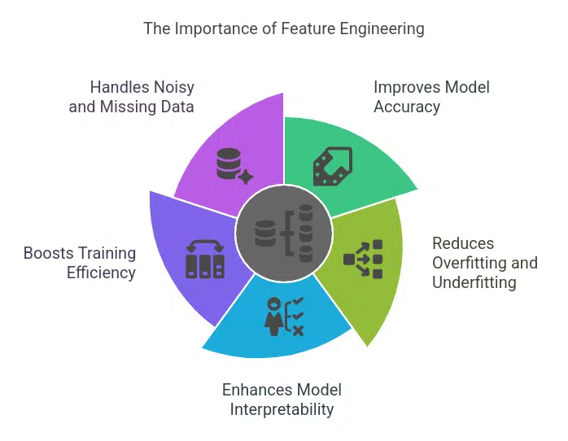
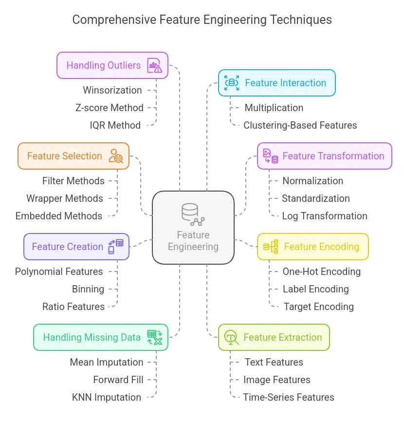

# Feature Engineering 
---
Before diving into different feature engineering techniques, let’s first understand the types of features available.

1. **Numerical features** : Numerical features represent data in numbers. They are continuous quantitative variables. Examples include height, age, and salary. 

2. **Categorical features** A categorical column can contain only discrete features. For example, a person’s gender is a categorical column, as it can only have a few gender types.

3. **Textual and time-series features**: Textual columns contain only text data. Examples include product reviews or product description columns in a retail dataset. On the other hand, time-series features represent timely data, such as weekly sales or stock price fluctuations over a year.

## 🔷 What is Feature Engineering? 

> Feature engineering means creating, modifying, or selecting features so that the model can learn better patterns.

Models don’t understand “students” or “study habits”. They only understand numbers and relationships

> Good features = better MAE, RMSE, R², accuracy

## 🔷 Why Feature Engineering Improves Results

* Raw data is often incomplete or weak
* Important relationships are hidden
* Feature engineering:
  * Makes patterns clearer
  * Reduces noise
  * Helps models generalize better

> In most ML projects, feature engineering improves performance more than changing models.

## Feature Engnieering steps/ Techniques

It could different steps like
1. **removing non-informative features** like student id
   1. `df_fe = df.drop(columns=['student_id'])`
2. Creating **new menaingful features** (by combining or merging)
   1. Example : `df_fe['study_attendance_interaction'] = df_fe['study_hours'] * df_fe['attendance_ratio']`
3. **Encoding** caetgorical features 
4. **Feature Extraction**: Create new features by combining or deriving information from existing ones to provide more meaningful input to the model.
5.**Feature Selection**: Choose the most relevant features for the model using techniques like correlation analysis, mutual information and stepwise regression.
6. **Handle Missing values**
7. **Handling Outliers**
8. **Feature scaling** : Feature scaling ensures that numerical features lie within a standardized range, preventing some features from dominating the learning process due to their larger values.

---
**Summary**
> Feature engineering is the process of creating meaningful input features that help models learn better patterns. 

> * In the student performance dataset, combining study hours with sleep and attendance reveals hidden relationships. 
> * Removing irrelevant features and encoding ordinal data properly improves learning.
> *  Good feature engineering reduces error and increases R² more effectively than switching models. 

It is the most important step in improving ML results.