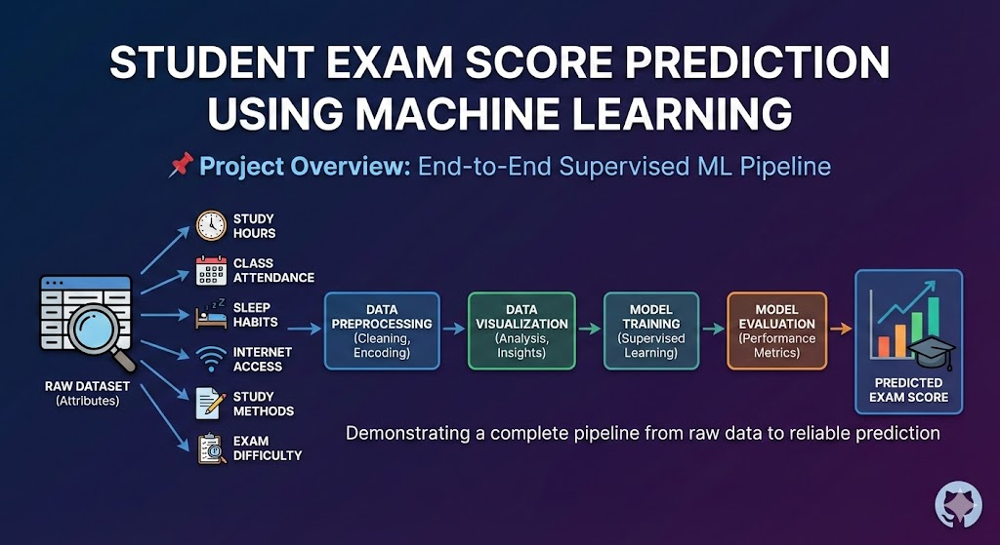

# Student Exam Score Prediction Using Supervised Machine Learning (Random Forest Regression)

## Project Overview

This project focuses on predicting students’ exam scores using supervised machine learning based on their academic, lifestyle, and behavioral attributes. The dataset includes features such as study hours, class attendance, sleep habits, internet access, study methods, and exam difficulty. The goal is to analyze how these factors influence academic performance and to build a reliable model for exam score prediction.

This project demonstrates a complete **end-to-end machine learning pipeline**, starting from raw data to final model evaluation, with strong emphasis on **data visualization and preprocessing**.

## Objectives of the Project

* To understand the key factors affecting student exam performance
* To perform detailed **data preprocessing and visualization**
* To build and compare **supervised learning regression models**
* To evaluate model performance using standard metrics
* To select the **best-performing model** for prediction

---

## Dataset Information

* **Source:** Kaggle – Exam Score Prediction Dataset
* **Records Include:**

* Student ID,Age, Gender ,Course, Study Hours, Class Attendance,Internet Access, Sleep Hours,Sleep Quality,Study Method,Facility Rating ,Exam Difficulty, Final Exam Score (Target Variable)

---

## What Has Been Done

1. Data Understanding & Cleaning
2. Categorical Encoding
3. Feature Scaling
4. Data Visualization (Exploratory Data Analysis)
5. Machine Learning Models Used (Two supervised regression models were trained and evaluated - **Linear regression & Random Forsest**) 
6. Model Evaluation & Results
7. Final Conclusion

> The **Random Forest Regressor outperformed Linear Regression** by achieving lower error and higher explanatory power. It was selected as the final model for predicting student exam scores. The results confirm that factors like **study hours, attendance, sleep quality, and study method** play a major role in academic performance.

---
## Future Improvements

* Hyperparameter tuning using GridSearchCV
* Cross-validation
* Model deployment using Streamlit
* Real-time student score prediction system

---

## Final Note

This project represents a complete **production-style machine learning workflow** with strong emphasis on preprocessing, visualization, model training, and evaluation. It is fully suitable for **GitHub portfolios, academic projects, and ML practice**.
